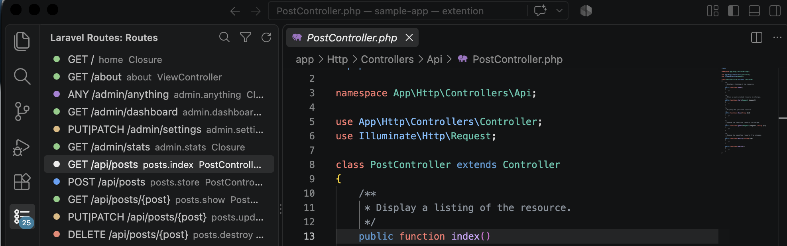
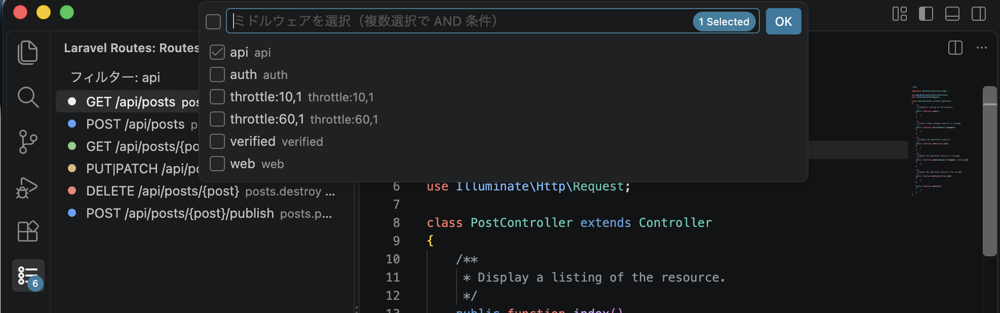

# Laravel Routes Explorer

[English](../README.md) | 日本語

Laravel プロジェクトのルート一覧を VSCode のサイドバーに表示する拡張です。
`php artisan route:list --json` の結果をツリー表示し、クリックでコントローラの該当メソッドへジャンプできます。





## 機能

- アクティビティバーの「Laravel Routes」アイコンからルート一覧を表示
- HTTP メソッドごとにアイコンの色を変えて表示（GET=緑、POST=青、PUT/PATCH=黄、DELETE=赤、ANY=紫）
- 各行にルート名とコントローラ@メソッドを表示。ホバーでミドルウェア一覧などの詳細をツールチップ表示
- ルートをクリックするとコントローラファイルを開き、対象メソッドの行へ移動
  - Invokable コントローラは `__invoke` へ移動
  - クロージャルートは Laravel 12 以降なら `route:list` が返す定義位置へ正確に移動。Laravel 11 では `routes/` 配下をルート名・URI で検索（ベストエフォート）
- 右クリックメニューから「Go to Source」（クリックと同じ）と「Go to Route Definition」（`routes/` 配下の定義行）を選べる
- ミドルウェアで絞り込み（複数選択で AND 条件）
- ルート一覧の再読み込み
- ツリーにフォーカスして `Cmd+F`（Windows/Linux は `Ctrl+Alt+F`）で URI やルート名のテキスト検索

## 必要環境

- VSCode 1.85 以上
- Laravel 11 以上、PHP 8.2 以上のプロジェクト
- `php artisan` を実行できること。Docker などホストに PHP がない環境でも、後述の設定でコマンドを差し替えれば使えます

## インストール

マーケットプレイスには公開していません。`.vsix` ファイルからインストールします。

```sh
code --install-extension laravel-routes-explorer-0.1.0.vsix
```

または VSCode の拡張機能ビューで「…」メニューから「VSIX からのインストール」を選びます。

## 使い方

1. Laravel プロジェクトを開く。`artisan` はワークスペースフォルダ直下でなくても自動検出される（サブフォルダにある場合はビュー名の横に相対パスが表示される）
2. アクティビティバーの「Laravel Routes」アイコンをクリック
3. ルート一覧が表示される。読み込み中はビューにプログレスバーが出る
4. ルートをクリックするとソースへジャンプ。右クリックで「Go to Route Definition」を選ぶと `Route::get(...)` の定義行へジャンプ
5. ビュータイトルのボタン
   - フィルター: ミドルウェアを選んで絞り込み。絞り込み中は一覧上部に条件が表示され、クリアボタンが現れる
   - 再読み込み: `route:list` を再実行

`route:list` の実行に失敗した場合は通知が出ます。詳細は出力パネルの「Laravel Routes」チャンネルで確認できます。

## 設定

| 設定 | 既定値 | 説明 |
|---|---|---|
| `laravelRoutes.command` | `php artisan route:list --json` | ルート一覧を取得するコマンド。プロジェクトルートを cwd としてシェル経由で実行する |
| `laravelRoutes.projectRoot` | `""` | `artisan` があるフォルダ。ワークスペースフォルダからの相対パスまたは絶対パス。空なら自動検出 |
| `laravelRoutes.exceptVendor` | `false` | vendor パッケージが定義したルートを除外する（`--except-vendor`） |

設定はワークスペース単位（`.vscode/settings.json`）で指定できます。変更すると自動で再読み込みします。

### プロジェクトがサブフォルダにある場合

自動検出はワークスペースフォルダ直下、次にワークスペース内の探索（`vendor`, `node_modules` は除く）の順で `artisan` を探します。複数ある場合や探索に時間がかかる場合は明示します。

```json
{
  "laravelRoutes.projectRoot": "backend"
}
```

### Docker や Sail で実行する場合

`laravelRoutes.command` にコマンド全体を指定します。コマンドは `projectRoot` を cwd として `/bin/sh` 経由で実行されます。`${projectRoot}` と `${workspaceFolder}` は実際のパスに展開されます。

```json
{
  "laravelRoutes.command": "docker compose exec -T app php artisan route:list --json"
}
```

Laravel Sail:

```json
{
  "laravelRoutes.command": "vendor/bin/sail artisan route:list --json"
}
```

コンテナ内の `route:list` が返すパスはプロジェクトルートからの相対パスなので、ソースをホストにマウントしていればジャンプもそのまま動きます。コントローラの解決には `vendor/composer/autoload_psr4.php` をホストから読めることが必要です。

## 制限事項

- Laravel 11 ではクロージャルートの定義位置が `route:list` に含まれないため、ファイル検索による推測です。`Route::prefix()` などで URI が組み立てられていると見つからないことがあります
- 複数の Laravel プロジェクトがある場合、最初に見つかったものだけを対象にします。`laravelRoutes.projectRoot` で明示してください
- `route:list` は Laravel アプリを起動するため、`.env` の不備などで失敗することがあります

## 開発

Node.js 24 以上と pnpm が必要です。

```sh
pnpm install
pnpm run compile   # または pnpm run watch
```

VSCode でこのフォルダを開き `F5` を押すと、拡張開発ホスト（Extension Development Host）が `sample-app/` を開いた状態で起動します。

### 動作確認用の Laravel プロジェクト

`sample-app/` は git 管理外です。次のスクリプトで作成できます（composer が必要）。

```sh
./scripts/create-sample-app.sh
```

PHP 8.3 以上と composer が必要です。別の PHP や composer を使う場合は `--php` と `--composer` でパスを指定します。メッセージは `LANG` に応じて日本語と英語が切り替わり、`--lang ja|en` で固定できます。`--help` でオプション一覧が出ます。

コントローラ@メソッド、Invokable、クロージャ、`Route::view` / `Route::redirect`、リソースルート、API ルート、prefix 付きグループ、複数ミドルウェアなど、拡張が扱うパターンを一通り含んだルートが `routes/web.php` と `routes/api.php` に定義されます。

- `src/extension.ts` — エントリーポイント。コマンド登録と読み込み処理
- `src/artisan.ts` — `route:list --json` の実行
- `src/routeParser.ts` — JSON の解析と正規化
- `src/routeProvider.ts` — TreeDataProvider とフィルター
- `src/navigation.ts` — ソースへのジャンプ

## パッケージ

```sh
pnpm run package
```

`laravel-routes-explorer-<version>.vsix` が生成されます。pnpm の `node_modules` 構成は `vsce` が解釈できないため `--no-dependencies` を付けています。ランタイム依存パッケージを追加する場合はバンドラー（esbuild など）の導入が必要です。

## リリース

`v` で始まるタグを push すると、GitHub Actions が vsix をビルドして GitHub Release に添付します（[release.yml](../.github/workflows/release.yml)）。

1. `package.json` の `version` を上げ、`CHANGELOG.md` に変更内容を書いてコミットする
2. バージョンと同じ名前のタグを付けて push する

```sh
git tag v0.1.0
git push origin main v0.1.0
```

タグと `package.json` の `version` が一致しないとワークフローは失敗します。`v0.1.0-beta.1` のようにハイフンを含むタグはプレリリースとして公開されます。リリースノートはコミット履歴から自動生成されます。

## ライセンス

MIT
